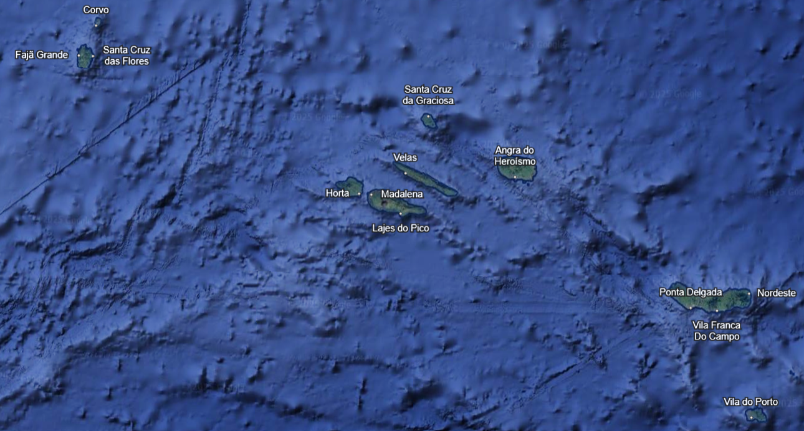

# The Azores

An autonomous region of Portugal, consisting of nine volcanic islands situated in the North Atlantic Ocean.

***

## Overview

**Flag:** 
    * 

**Motto:** "Antes morrer livres que em paz sujeitos!" 
    * English: "Rather die free than subjected in peace!"

**Anthem:** "Hino dos Açores"
    * Instrumental: 
    <audio controls src="/azores-wiki/audio/hino-instrumental.mp3"></audio>
    * Vocal: 
    <audio controls src="/azores-wiki/audio/hino-cantado.mp3"></audio>

**Official Name:** Região Autónoma dos Açores
    * English: Autonomous Region of the Azores

**Country:** Portugal

**Settlement Autonomous Status:** April 30, 1976

**Named For:** Açor-Nortenho
    * English: Eurasian Goshawk
        * 

**Capitals:**
    * Ponta Delgada (São Miguel Island) - Executive and Legislative
    * Horta (Faial Island) - Judicial
    * Angra do Heroísmo (Terceira Island) - Historical

**Largest City:** Ponta Delgada

**Official Language:** Portuguese

**Demonym(s):** Açoriano
    * English: Azorean

***

## Government

* **Autonomous Region:**
    * **Representative of the Republic:** Pedro Manuel dos Reis Alves Catarino
    * **President of the Regional Government:** José Manuel Bolieiro
    * **President of the Legislative Assembly:** Luís Garcia
    * **Vice-President of the Regional Government:** Artur Lima
* **Legislature:** Legislative Assembly
* **National and European Representation:**
    * **Assembly of the Republic (Portugal):** 6 MPs (of 230)
    * **European Parliament:** 3 MEPs (of 21 Portuguese seats)

***

## Geography

* **Area (Total):** 2,331 km² (900 sq mi)
* **Highest Elevation:** Mount Pico (Pico Island) - 2,351 m (7,713 ft)
* **Lowest Elevation:** Atlantic Ocean - 0 m (0 ft)

***

## Population

* **2021 Census:** 236,440
* **Density:** 110/km² (284.9/sq mi)

***

## Economy

* **GDP (Nominal) (2023):** €5.376 billion
* **GDP (Nominal) per capita (2023):** €22,346
* **Currency:** Euro (€) (EUR)

***

## Time Zone

* **Time zone:** UTC-01:00
* **Summer (DST):** UTC±00:00

***

## Miscellaneous

* **Date Format:** dd/mm/yyyy (CE)
* **Driving Side:** Right
* **Calling Code:** +351 (292/295/296)
* **Postal Code:** 95nn-99nn
* **ISO 3166 Code:** PT-20
* **Internet TLD:** .pt
* **Abbreviation:** RAA
* **Website:** [azores.gov.pt](https://azores.gov.pt/)